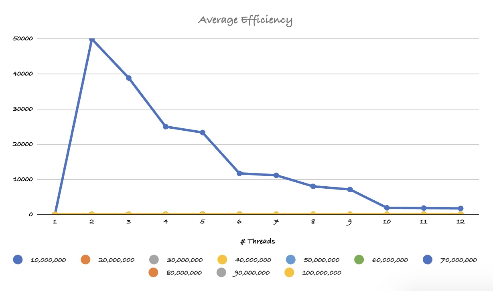

# Reflection 04, OpenMP III: Producers and Consumers

Winston Shi

## Summary

Use OpenMP to implement a producer consumer program in which some of the threads are producers and others are consumers. The producers read text from a collection of files, one per producer. They insert lines of text into a single shared queue. The consumers take the lines of text and tokenize them. Tokens are “words” separated by white space. When a consumer finds a token, it writes it to `stdout`.

Evaluate the exercise using 1-12 threads for the producer, 1-12 threads for consumer, and 12 text files that you find somewhere or randomly generate (they should be of similar size).

## Key Notes & Code Snippet

 * synchronize threads before continuing past statement

```cpp    
#pragma omp barrier
```

 * applies to the next line of code only
 * high performance
 * x\<op> = expression (x -= 1)
 * "+" 
 * "-"
 * "*" 
 * "/" 
 * "&" 
 * "^" 
 * "|"
 * "<<"
 * ">>"
 * Load, modify, store

```cpp
#pragma omp atomic
```

 Gets a section of code that must be executed by a single thread at a time.

```cpp
#pragma omp critical
```

Locks data to protect data from desynchronization.

```cpp
omp_init_unlock(omp_lock_t*)
omp_set_unlock(omp_lock_t*)
omp_unset_unlock(omp_lock_t*)
omp_destroy_unlock(omp_lock_t*)
```


## Run Locally

Clone Repository

```bash
    git clone git@github.com:WinstonShi10/CS4170_FA2024_R04_SHI.git reflection_04
```

Change directory

```bash
    cd reflection_04
```

Run bash file

```bash
    sh run.sh
```

## Run on OpenMP

Login to the Ohio Super Computer

```bash
ssh USERNAME@owens.osc.edu
```

Load the Git module and setup the environment to use a specific version of Git

```bash
module load git
```

Remove the value of the SSH_ASKPASS environment variable

```bash
unset SSH_ASKPASS
```

Clone repository

```bash
git clone git@github.com:WinstonShi10/CS4170_FA2024_R04_SHI.git reflection_04
```

Change directory

```bash
cd reflection_04
```

Submit job using SLURM file

```bash
sbatch jobScript.slurm
```

Come back to repository after job completion confirmation

<div align="center">
    
<div align="left">

Change directory to Default File

```bash
cd Default
```

Open CVS file to see result

```bash
cat results.csv
```

## Check Job

job status

```bash
squeue -j BATCH_ID_NUM
```

OSC job queue

```bash
squeue
```

Show batch job information:
 * Resource usage statistics
 * CPU usage
 * Memory usage
 * I/O operations
 * Process creation rate

```bash
sacct -j BATCH_ID_NUM
```

## Speedup


The speedup seems to show that at the earlier loops, it seems that the less threads the better run time.

## Efficiency



It seems like at 3 producers and 1 consumer is where the efficiency peaks.

The later results seem to drastically fall off.

## Karp-Flatt Metric


I don't understand why but having one consumer leads to the best results, even when there are ~100,000 lines per file.

## Performance

It seems that there is a drastic decrease in performance in parallelizing data synchronization. It seems that as you increase the number of consumers, the more overhead is created due to the consumers waiting on the producers.

### What is the optimal number of producers and consumers?

 * 3 Producers, 1 Consumer

 * 5 Producers, 1 Consumer

### time spent on this reflection

2 Hours

### time spent coding

5 Hours

### time spent writing

2 Hours

### time spent testing

2 Hours

### time spent analyzing

1.5 Hours